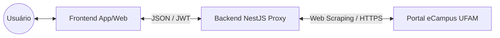

# UFAM Academics (Meu Campus) 🎓

[](https://nestjs.com/)
[](https://reactnative.dev/)
[](https://www.typescriptlang.org/)
[](https://en.wikipedia.org/wiki/Hexagonal_architecture_(software))

O **UFAM Academics** (codinome: *Meu Campus*) é uma plataforma independente desenvolvida para modernizar a experiência de acesso às informações acadêmicas do eCampus da Universidade Federal do Amazonas (UFAM). O projeto atua como uma camada de experiência (**UX Layer**), oferecendo uma interface limpa, rápida e otimizada para dispositivos móveis, mantendo o sistema oficial como única fonte da verdade.

---

## 🚀 Visão Geral

O sistema eCampus original, embora centralize dados vitais, possui uma interface legada que pode ser de difícil navegação em dispositivos móveis. O **UFAM Academics** resolve essa fricção através de:

- **Interface Responsiva:** Desenvolvida em React Native (Expo) para uma experiência nativa em Android/iOS e consistente na Web.
- **API Proxy de Alta Performance:** Um backend em NestJS que realiza o *web scraping* do portal oficial e entrega dados estruturados (JSON).
- **Consumo Inteligente:** Redução drástica no tráfego de dados ao carregar apenas o essencial para a interface.
- **Segurança Transparente:** Autenticação direta com o sistema institucional sem intermediários de armazenamento.

---

## 🛠️ Tecnologias e Arquitetura

O projeto foi construído sob princípios de **Engenharia de Software de alta qualidade**, garantindo que o código seja testável e fácil de evoluir.

### Stack Técnica
- **Frontend:** React Native, Expo, React Native Web, TypeScript, Lucide Icons.
- **Backend:** NestJS, TypeScript, Axios, Tough Cookie, Node HTML Parser, JWT.
- **Arquitetura:** Hexagonal (Ports and Adapters) e Domain-Driven Design (DDD).

### Diagrama de Arquitetura


### Decisões de Design
A utilização da **Arquitetura Hexagonal** isola a lógica de negócio (Domínio) das tecnologias externas. Isso significa que a lógica de "extração de dados" (Infraestrutura) está separada da lógica de "exibição" (Apresentação). Caso o eCampus mude seu layout, apenas os *parsers* na camada de infraestrutura precisam de ajuste, sem afetar o restante do ecossistema.

---

## ✨ Funcionalidades

- [x] **Login Institucional:** Autenticação segura via CPF e senha do eCampus.
- [x] **Perfil Acadêmico:** Visualização de dados de vínculo, curso e coeficiente.
- [x] **Notas e Frequência:** Histórico organizado por ano e período letivo.
- [x] **Grade Horária:** Visualização clara das aulas da semana.
- [x] **Planos de Ensino:** Consulta detalhada de disciplinas, conteúdos e critérios de avaliação.
- [x] **Sessão Persistente:** Gerenciamento de sessão via JWT com tempo de vida sincronizado ao portal oficial.
- [ ] **IA Acadêmica (Roadmap):** Assistente inteligente para interpretação de histórico e normas da UFAM.

---

## 🔒 Segurança e Privacidade (Compliance)

A segurança foi priorizada em cada linha de código:

1. **Zero Data Retention:** O sistema **NÃO possui banco de dados** e **NÃO armazena senhas**. As credenciais são usadas apenas em memória para realizar o *handshake* com o eCampus.
2. **Criptografia em Trânsito:** Toda comunicação entre App, API e eCampus é realizada estritamente via HTTPS.
3. **Gestão de Sessão:** Utilização de tokens JWT para manter o estado do usuário, garantindo que o backend seja *stateless* e seguro.
4. **Respeito à LGPD:** O projeto segue o princípio da **Minimização de Dados**, tratando apenas as informações que o usuário já possui direito de acesso no portal oficial.

---

## ⚙️ Como Rodar Localmente

O projeto está organizado em um monorepo com pastas independentes para `app` e `api`.

### 1. Backend (API)
```bash
cd api
npm install
cp .env.example .env
# Configure ECAMPUS_JWT_SECRET e FRONTEND_ORIGIN no .env
npm run dev
```

### 2. Frontend (App)
```bash
cd app
npm install
cp .env.example .env
# Configure EXPO_PUBLIC_ECAMPUS_API_URL no .env
npm run start
```

---

## ⚠️ Disclaimer Legal

Este é um **projeto independente** de código aberto, criado para fins de estudo e melhoria de experiência de uso. 
- **Não é um produto oficial da UFAM.**
- Não possui qualquer vínculo institucional ou governamental.
- O projeto realiza apenas operações de **leitura**; nenhuma informação é alterada no sistema original.
- O uso das credenciais é de responsabilidade exclusiva do usuário final.

---

## 🤝 Contribuição

Contribuições que mantenham a integridade arquitetural do projeto são bem-vindas. 

1. Faça um Fork do repositório.
2. Crie uma branch para sua funcionalidade (`git checkout -b feature/AmazingFeature`).
3. Certifique-se de que o `typecheck` e o `build` estão passando.
4. Abra um Pull Request detalhado.

---
Desenvolvido com foco em excelência técnica para a comunidade da **Universidade Federal do Amazonas**.
