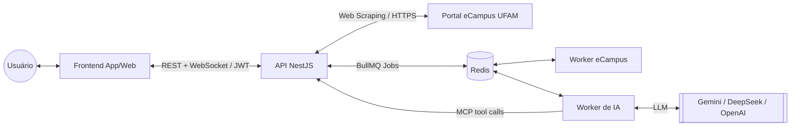

# UFAM Academics (Meu Campus) 🎓

[](https://nestjs.com/)
[](https://reactnative.dev/)
[](https://www.typescriptlang.org/)
[](https://en.wikipedia.org/wiki/Hexagonal_architecture_(software))
[](https://redis.io/)
[](https://modelcontextprotocol.io/)

O **UFAM Academics** (codinome: *Meu Campus*) é uma plataforma independente desenvolvida para modernizar a experiência de acesso às informações acadêmicas do eCampus da Universidade Federal do Amazonas (UFAM). O projeto atua como uma camada de experiência (**UX Layer**), oferecendo uma interface limpa, rápida e otimizada para dispositivos móveis, mantendo o sistema oficial como única fonte da verdade. Além do proxy de dados acadêmicos, o sistema conta com um **assistente de IA acadêmica** que conversa em tempo real e consulta notas, horários e planos de ensino do próprio usuário via **MCP (Model Context Protocol)**.

---

## 🚀 Visão Geral

O sistema eCampus original, embora centralize dados vitais, possui uma interface legada que pode ser de difícil navegação em dispositivos móveis. O **UFAM Academics** resolve essa fricção através de:

- **Interface Responsiva:** Desenvolvida em React Native (Expo) para uma experiência nativa em Android/iOS e consistente na Web.
- **API Proxy de Alta Performance:** Um backend em NestJS que realiza o *web scraping* do portal oficial e entrega dados estruturados (JSON).
- **Processamento Assíncrono:** Scraping do eCampus e conversas de IA rodam em *workers* dedicados, comunicados via filas (BullMQ/Redis), sem bloquear a API.
- **Notificações em Tempo Real:** Resultados de scraping e respostas da IA chegam ao app via WebSocket assim que ficam prontos.
- **Assistente de IA com Contexto Real:** Um servidor MCP na API expõe ferramentas (notas, horário, plano de ensino) que o worker de IA consulta sob demanda para responder com dados reais do usuário.
- **Consumo Inteligente:** Redução drástica no tráfego de dados ao carregar apenas o essencial para a interface.
- **Segurança Transparente:** Autenticação direta com o sistema institucional sem intermediários de armazenamento.

---

## 🛠️ Tecnologias e Arquitetura

O projeto foi construído sob princípios de **Engenharia de Software de alta qualidade**, garantindo que o código seja testável e fácil de evoluir.

### Stack Técnica
- **Frontend (`app/`):** React Native, Expo, React Native Web, TypeScript, Lucide Icons.
- **API (`api/`):** NestJS, TypeScript, Axios, Tough Cookie, Node HTML Parser, JWT, Socket.IO (WebSocket), servidor MCP.
- **Worker de eCampus (`workers/ecampus/`):** Node.js, TypeScript, BullMQ — faz o *web scraping* do portal oficial de forma assíncrona.
- **Worker de IA (`workers/ai/`):** Node.js, TypeScript, BullMQ, Vercel AI SDK — processa o chat e integra provedores de LLM (Gemini, DeepSeek, OpenAI).
- **Infraestrutura:** Redis (filas BullMQ + Pub/Sub + cache de curta duração), Docker/Docker Compose.
- **Arquitetura:** Hexagonal (Ports and Adapters) e Domain-Driven Design (DDD), organizada como monorepo com 4 serviços independentes.

### Diagrama de Arquitetura


Fluxo assíncrono típico (ex.: chat de IA): o app envia a mensagem para a API, que responde `202 Accepted` de imediato e enfileira o job no Redis; o `ai-worker` processa a mensagem (consultando dados acadêmicos reais via MCP quando necessário) e publica o resultado em um canal Redis Pub/Sub; a API está inscrita nesse canal e repassa a resposta ao app em tempo real via WebSocket, na sala específica daquele usuário. O mesmo padrão (fila → processamento → pub/sub → WebSocket) é usado para eventos de scraping do eCampus (login, notas, bootstrap prontos).

### Decisões de Design
A utilização da **Arquitetura Hexagonal** isola a lógica de negócio (Domínio) das tecnologias externas. Isso significa que a lógica de "extração de dados" (Infraestrutura) está separada da lógica de "exibição" (Apresentação). Caso o eCampus mude seu layout, apenas os *parsers* na camada de infraestrutura precisam de ajuste, sem afetar o restante do ecossistema.

O processamento pesado (scraping, chamadas a LLMs) foi extraído da API para **workers assíncronos** dedicados, comunicados via **filas BullMQ sobre Redis**. Isso mantém a API responsiva (respostas imediatas com `202 Accepted` + notificação posterior via WebSocket) e permite escalar cada worker de forma independente.

A integração com IA usa o **Model Context Protocol (MCP)**: a API expõe um servidor MCP com ferramentas de consulta a dados acadêmicos (perfil, notas, horário, plano de ensino), e o `ai-worker` atua como cliente MCP, permitindo que o LLM consulte dados reais e atualizados do usuário durante a conversa (tool calling), em vez de depender apenas do conhecimento estático do modelo.

---

## ✨ Funcionalidades

- [x] **Login Institucional:** Autenticação segura via CPF e senha do eCampus.
- [x] **Perfil Acadêmico:** Visualização de dados de vínculo, curso e coeficiente.
- [x] **Notas e Frequência:** Histórico organizado por ano e período letivo.
- [x] **Grade Horária:** Visualização clara das aulas da semana.
- [x] **Planos de Ensino:** Consulta detalhada de disciplinas, conteúdos e critérios de avaliação.
- [x] **Sessão Persistente:** Gerenciamento de sessão via JWT com tempo de vida sincronizado ao portal oficial.
- [x] **Assistente de IA Acadêmica:** Chat assíncrono em tempo real (Redis + WebSocket) com acesso a notas, horário e planos de ensino do usuário via MCP.
- [x] **Notificações em Tempo Real:** Eventos de scraping e respostas de IA entregues por WebSocket assim que ficam prontos.

---

## 🔒 Segurança e Privacidade (Compliance)

A segurança foi priorizada em cada linha de código:

1. **Zero Data Retention:** O sistema **NÃO possui banco de dados relacional/persistente** e **NÃO armazena senhas**. As credenciais são usadas apenas em memória para realizar o *handshake* com o eCampus. O único armazenamento intermediário é o Redis, usado exclusivamente como broker de filas, canal de Pub/Sub e cache de curta duração — nunca para persistir credenciais.
2. **Criptografia em Trânsito:** Toda comunicação entre App, API e eCampus é realizada estritamente via HTTPS.
3. **Gestão de Sessão:** Utilização de tokens JWT para manter o estado do usuário, garantindo que o backend seja *stateless* e seguro.
4. **Respeito à LGPD:** O projeto segue o princípio da **Minimização de Dados**, tratando apenas as informações que o usuário já possui direito de acesso no portal oficial.

---

## ⚙️ Como Rodar Localmente

O projeto está organizado em um monorepo com 4 serviços independentes: `app`, `api`, `workers/ecampus` e `workers/ai`, além de uma instância de Redis compartilhada.

Cada serviço usa **apenas** um arquivo de dev e um de produção — sem `.env` puro. `api`, `workers/ai` e `workers/ecampus` usam `.env.local`/`.env.production`; `app` usa `.env.development`/`.env.production` (motivo na seção 4, abaixo). Todos são gitignored; use `.env.example` como referência de quais chaves preencher.

### Opção rápida: Docker Compose
Sobe `redis`, `api`, `ai-worker` e `ecampus-worker` de uma vez (configure antes o `.env.local` de cada serviço a partir do respectivo `.env.example`):
```bash
docker compose up --build
```
O frontend (`app/`) continua rodando localmente via Expo (ver abaixo).

**Quer testar como o sistema se comporta com config de produção, sem sair da sua máquina?** Preencha o `.env.production` de cada serviço (`api`, `workers/ai`, `workers/ecampus`) e suba com o arquivo de override:
```bash
docker compose -f docker-compose.yml -f docker-compose.production-test.yml up --build
```
Isso troca o `env_file` de cada serviço para `.env.production` (então valores como rate limit, `FRONTEND_ORIGIN`, chaves de provedor de IA, etc. viram os de produção), mas mantém `REDIS_URL` fixo no container Redis local — você não está saindo da sua máquina, só testando a config de produção contra a infra local. Sobe containers com o mesmo nome do modo normal, então rode `docker compose down` (com o mesmo `-f -f` do modo que estava rodando) antes de trocar de modo.

Não existe uma flag `--prod` no `docker compose` — a troca de arquivo de config é feita combinando os dois arquivos com `-f -f`, como acima.

Sem Docker, dá pra fazer o mesmo por serviço com `npm run dev:prod-env` (usa `.env.production` em vez de `.env.local`, sem mudar `NODE_ENV`).

### 1. Backend (API)
```bash
cd api
npm install
cp .env.example .env.local
# Configure ECAMPUS_JWT_SECRET, FRONTEND_ORIGIN e REDIS_URL no .env.local
npm run dev
```

### 2. Worker de eCampus (scraping assíncrono)
```bash
cd workers/ecampus
npm install
cp .env.example .env.local
# Configure REDIS_URL e ECAMPUS_SCRAPE_QUEUE no .env.local
npm run dev
```

### 3. Worker de IA (chat)
```bash
cd workers/ai
npm install
cp .env.example .env.local
# Configure REDIS_URL, AI_CHAT_QUEUE, MCP_SERVER_URLS e as chaves do provedor de IA (ex.: GEMINI_API_KEY) no .env.local
npm run dev
```

### 4. Frontend (App)
> ⚠️ Único dos 4 projetos que usa `.env.development` em vez de `.env.local` — na convenção nativa do Expo (`@expo/env`), `.env.local` tem prioridade sobre `.env.production` **independente** do modo, então os dois nunca poderiam coexistir aqui sem quebrar o toggle. `.env.development`/`.env.production` são os arquivos por-modo de verdade.
```bash
cd app
npm install
cp .env.example .env.development
# Configure EXPO_PUBLIC_ECAMPUS_API_URL no .env.development
npm run start              # NODE_ENV=development → carrega .env.development
npm run start:prod-env     # NODE_ENV=production  → carrega .env.production, sem sair da máquina
```

---

## ⚠️ Disclaimer Legal

Este é um **projeto independente** de código aberto, criado para fins de estudo e melhoria de experiência de uso. 
- **Não é um produto oficial da UFAM.**
- Não possui qualquer vínculo institucional ou governamental.
- O projeto realiza apenas operações de **leitura**; nenhuma informação é alterada no sistema original.
- O uso das credenciais é de responsabilidade exclusiva do usuário final.

---

## 🤝 Contribuição

Contribuições que mantenham a integridade arquitetural do projeto são bem-vindas. 

1. Faça um Fork do repositório.
2. Crie uma branch para sua funcionalidade (`git checkout -b feature/AmazingFeature`).
3. Certifique-se de que o `typecheck` e o `build` estão passando.
4. Abra um Pull Request detalhado.

---
Desenvolvido com foco em excelência técnica para a comunidade da **Universidade Federal do Amazonas**.
